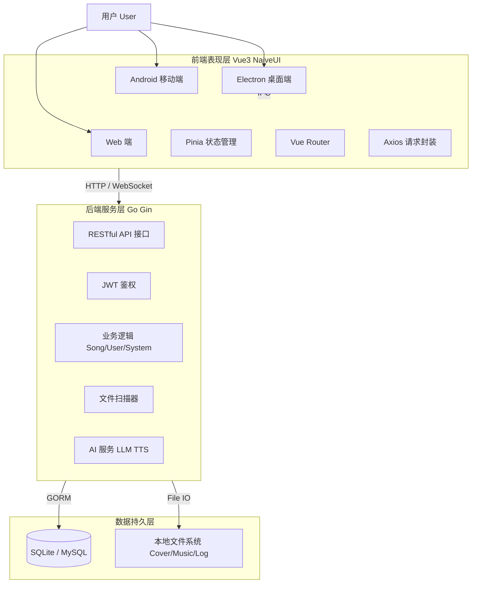

# RLMusic

基于 Vue 3 + Go 的多端本地音乐播放器，支持 Web、Electron、Android（Capacitor）。  
提供歌曲管理、播放控制、后台管理、一起听、AI 文案/开场白等能力。

## 功能亮点
- **多端统一体验**：Web / Electron / Android 一套核心交互。
- **沉浸式播放**：歌词、封面、播放器动效与多视图歌曲列表。
- **AI 能力**：歌单文案生成、播客开场白合成。
- **实时互动**：一起听房间与实时消息同步（WebSocket）。
- **后台管理**：用户、公共歌单等管理能力。

## 系统架构



## 技术栈
- **前端**：Vue 3、TypeScript、Vite、Pinia、Naive UI
- **桌面端**：Electron、Electron Builder
- **移动端**：Capacitor（Android）
- **后端**：Go（Gin）、Gorm、SQLite / MySQL

生成这个项目的概述，用于毕业设计文档的AI参考，尽量详细一些，可以精确到具体的文件和文件夹，生成到一个markdown文件里
## 目录结构

项目采用 Monorepo 风格的目录组织，将前端 Web、Electron 主进程、Go 后端以及 Android 原生工程集中在一个仓库中进行管理。

```text
.
├─ src/                  # 前端 Vue 3 源码目录
│  ├─ api/               # API 接口统一封装，使用 Axios 进行网络请求
│  ├─ components/        # 可复用的 Vue 组件库 (如 Player、Nav、Admin 等)
│  ├─ core/              # 核心业务逻辑 (包含 Websocket 通信、Timeline 调度等)
│  ├─ router/            # Vue Router 路由配置及导航守卫
│  ├─ store/             # Pinia 状态管理 (音乐播放状态、用户数据、设置等)
│  ├─ style/             # 全局样式文件 (SCSS)
│  ├─ utils/             # 通用工具函数 (时间格式化、加密解密、防抖节流等)
│  └─ views/             # 页面级视图组件 (首页、歌单、搜索、管理后台等)
│
├─ server/               # Go (Gin) 后端源码目录
│  ├─ cmd/               # 服务端入口文件 (main.go)
│  ├─ internal/          # 内部核心逻辑，按职责划分
│  │  ├─ global/         # 全局变量、配置结构体、统一返回格式
│  │  ├─ handle/         # 控制器层，处理 HTTP 请求逻辑
│  │  ├─ middleware/     # Gin 中间件 (Auth鉴权、统计拦截等)
│  │  ├─ model/          # GORM 数据库模型定义及基础 DB 操作
│  │  └─ ws/             # WebSocket 服务端实现，处理长连接通信
│  ├─ utils/             # 后端工具包 (AI调用、音频解析、JWT、加密等)
│  ├─ prompts/           # LLM (大语言模型) 提示词 Markdown 模板
│  ├─ config.yml         # 后端服务主配置文件
│  └─ Dockerfile         # 后端 Docker 构建文件
│
├─ electron/             # Electron 桌面端主进程目录
│  ├─ main.ts            # 主进程入口，管理窗口、系统托盘、IPC 通信
│  └─ preload.ts         # 预加载脚本，向渲染进程安全暴露 Node.js API
│
├─ android/              # Capacitor 生成的 Android 原生工程目录
│
├─ public/               # 静态资源目录 (不经过 Vite 编译直接复制，如 favicon、默认头像)
│
├─ docker-compose.yml    # Docker 容器编排配置文件 (前后端一键部署)
├─ Dockerfile.web        # 前端 Nginx 部署构建文件
├─ vite.config.ts        # Vite 构建配置文件
├─ capacitor.config.ts   # Capacitor 跨平台配置文件
└─ package.json          # 项目依赖及 npm scripts 脚本定义
```

## 快速开始

### 1) 开发模式
**前置依赖**
- Node.js（推荐 18+）
- Go
- pnpm

**安装依赖**
```bash
pnpm install
```

**启动后端**
```bash
cd server
go mod tidy
air
```
后端默认地址：`http://localhost:12345`

**启动前端**
```bash
pnpm dev:web
```
前端默认地址：`http://localhost:23456`

**启动 Electron（可选）**
```bash
pnpm dev
```

### 2) 构建产物
```bash
pnpm build:web
pnpm build:client
pnpm build:server
pnpm build:android
pnpm build:all
```
- Web 输出目录：`dist/`
- Electron 输出目录：`release/`

### 3) Docker 部署

项目采用前后端分离容器：
- 容器名：`RLMusic-frontend`、`RLMusic-backend`
- 镜像名：`rlmusic:frontend`、`rlmusic:backend`

#### 相关文件
- `docker-compose.yml`：服务定义、端口、挂载、容器名
- `Dockerfile.web`：前端构建与 Nginx 托管
- `server/Dockerfile`：后端构建与运行
- `.dockerignore`：减少构建上下文体积

#### 启动
```bash
docker compose up -d --build
```

#### 访问
- 前端：`http://localhost:23456`
- 后端：`http://localhost:12345`

#### 后端数据与音乐目录（Bind Mount）
- `./data -> /app/data`
- `./log -> /app/log`
- `${MUSIC_BIND_PATH:-C:/RLMusic} -> /music`

说明：
- 默认音乐目录为 `C:/RLMusic`
- 如果宿主机不存在该目录，Docker 会自动创建
- 可通过 `.env` 自定义音乐目录

`.env` 示例：
```bash
MUSIC_BIND_PATH=C:/MyMusic
```

应用修改后：
```bash
docker compose up -d --build
```

#### 音乐导入步骤
1. 把音乐文件复制到 `C:/RLMusic`（或你的 `MUSIC_BIND_PATH`）目录。
2. 重启后端容器：
```bash
docker compose restart backend
```
3. 在前端执行一次音乐扫描。

### 4) 压力测试（分阶段升压 + 流式播放独立测试）

项目根目录提供压测脚本：`api_test_scan.py`。  
脚本会先创建测试用户，再执行两类压测：
- 通用 API 分阶段升压压测（搜索、系统、歌单、详情等）
- 歌曲流式播放独立压测（`/api/song/stream/:id`，单独统计）

**运行方式**
```bash
python api_test_scan.py
```

**前置条件**
- 后端服务已启动：`http://localhost:12345`
- 前端服务已启动（用于 `web_home` 场景）：`http://localhost:23456`
- 音乐库中至少有可播放歌曲（用于流式播放场景自动发现 `song_id`）

**关键参数（`api_test_scan.py`）**
- `TEST_USER_COUNT`：测试用户创建数量
- `REQUEST_TIMEOUT`：单次请求超时（秒）
- `STREAM_READ_BYTES`：流式播放每次探测最大读取字节数（默认 `64KB`）
- `PRESSURE_STAGES`：分阶段升压配置，支持多阶段并发与总请求数

`PRESSURE_STAGES` 示例：
```python
PRESSURE_STAGES = [
    {"name": "stage-1", "concurrency": 20, "total_requests": 300},
    {"name": "stage-2", "concurrency": 50, "total_requests": 1000},
    {"name": "stage-3", "concurrency": 100, "total_requests": 3000},
]
```

**输出说明**
- 每个阶段会输出：`总QPS`、各场景 `QPS`、成功率、`P95/P99`
- 流式播放会额外输出：`TTFB(P95)`（首包时间，越低通常表示起播越快）
- 最后分别输出两张总览：
  - `分阶段总览`（通用 API）
  - `流式播放分阶段总览`（播放链路）

## 配置说明

### 前端环境变量（`.env`）
| 变量名 | 说明 | 默认值 |
| :--- | :--- | :--- |
| `VITE_MUSIC_API` | 后端 API 地址 | `http://localhost:12345` |
| `VITE_APP_MODE` | 应用模式（web/client/server） | `web` |
| `VITE_ANN_TITLE` | 首页公告标题 | - |
| `VITE_ANN_CONTENT` | 首页公告内容 | - |

### 后端配置（`server/config.yml`）
```yaml
Server:
  Port: :12345
  DbType: "sqlite"
Sqlite:
  Dsn: "data.db"
BasicPath:
  FilePath: "./music"
QwenTTS:
  ApiKey: "sk-..."
SiliconFlow:
  ApiKey: "sk-..."
```

## AI功能的使用
需要现在系统环境变量添加 `QwenTTS_API_KEY` 和 `SiliconFlow_API_KEY` 两个变量，值分别为 Qwen 平台和 SiliconFlow 平台的 API 密钥。


## 致谢
- [Vue 3](https://vuejs.org/) / [Vite](https://vitejs.dev/)
- [Naive UI](https://www.naiveui.com/)
- [Pinia](https://pinia.vuejs.org/)
- [Gin](https://gin-gonic.com/)
- [GORM](https://gorm.io/)
- [Capacitor](https://capacitorjs.com/)
- [Electron](https://www.electronjs.org/)

## License
MIT

# TODO
生成概述后再提示
删除或重写桌面歌词功能
支持用户在设置页里自定义模型和api
优化搜索栏，如不区分大小写，区分关键词
音频传输的是什么，是如何传输的
提示词是否打包进了electron服务端里
修改项目名为RLMusic，删除所有localmusicplayer的字段
electron端当歌曲无对应信息时，应该如何处理
